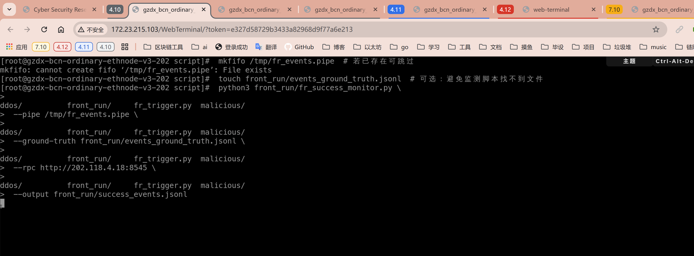
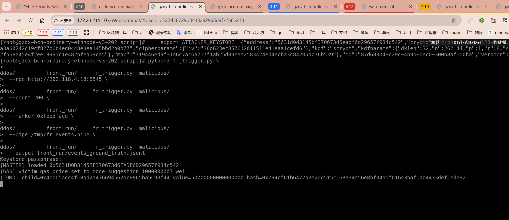
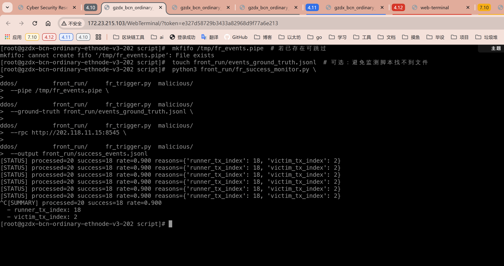

3.2.3.20 抢跑成功率 (Front-running Success Rate)
===============================================

定义
----
抢跑成功率衡量在测量窗口内发起的抢跑尝试中，有多少真实实现了“抢在受害交易之前成交并达成既定收益条件”。统一触发器会在每次攻击中先广播受害交易（`victim`）再交替广播抢跑交易（`runner`），并在日志中标记预期结果。检测脚本需结合交易回执与区块顺序确认抢跑是否成功。

指标体系
--------
在统一的事件表中维护：
- `A`：所有抢跑尝试事件集合；
- `S`：被判定为成功的事件集合，判定条件为 runner 成功上链且目标状态满足触发器记录的条件；若 runner 被拒绝或 victim 先于 runner 成交，则视为失败。

据此定义抢跑成功率：

\[ FSR = \frac{|S|}{|A|} \]

若 `A = 0`，脚本输出空窗口提示，不再计算比例。

观测数据来源
------------
1. **统一触发器**：`fr_trigger.py` 生成 victim/runner 成对交易，并将 ground-truth（`fr-trigger-event-v1`）写入 `front_run/events_ground_truth.jsonl`。若指定 `--pipe`，每笔交易会同步推送 `fr-trigger-tx-v1` 行到命名管道，字段含 `pair_id`、`role`、`tx_hash`、`gas_price`、`input_marker`。
2. **链上数据**：检测脚本 `fr_success_monitor.py` 按需读取命名管道实时更新候选集，并辅以 RPC 轮询 `eth_pendingTransactions`（回退到 `eth_getBlock("pending", full_transactions=True)`）收集外部流量；在短周期内查询 `eth_getTransactionReceipt` 与区块顺序确认 runner 是否抢先 victim。
3. **补充状态**：当 runner 向同一合约写入状态时，可选调用 `eth_call` 或检查日志 topics 来验证收益是否实现。

实验流程
--------
0. **准备命名管道并启动监测脚本**
```sh
	 mkfifo /tmp/fr_events.pipe  # 若已存在可跳过
	 touch front_run/events_ground_truth.jsonl  # 可选：避免监测脚本找不到文件
	 python3 front_run/fr_success_monitor.py \
		 --pipe /tmp/fr_events.pipe \
		 --ground-truth front_run/events_ground_truth.jsonl \
		 --rpc http://202.118.4.18:8545 \
		 --output front_run/success_events.jsonl
	 ```
	 - 通过 `--rpc` 或 `--hosts hosts_fr.txt`（文件每行一个 HTTP RPC 地址）提供至少一个可用节点，脚本会轮询各 RPC 查询交易回执。
	 - 监测脚本会在 FIFO 连接成功后阻塞等待触发器写入，若 FIFO 尚未建立会每秒重试。
	 - 可根据链上延迟将 `--poll-interval`（默认 2.5 s）与 `--reject-delay`（默认 20 s）调大或调小。



1. **启动触发器**（攻击节点）
	 ```sh
    export ATTACKER_KEYSTORE='{"address":"5631d0d3145bf370673d6eadf6d29657f934c542","crypto":{"cipher":"aes-128-ctr","ciphertext":"98553dd168cb6da7feb3a9a3a60242c19cf827b6b4ed0448e8ea145bbd2b0b77","cipherparams":{"iv":"38d623ec857612011511e41eaa1cefd6"},"kdf":"scrypt","kdfparams":{"dklen":32,"n":262144,"p":1,"r":8,"salt":"7877745b08004d6737b64d8b9889192fb68e45e4f2ee18991c1e482bfea59ca5"},"mac":"719446ed9f31a6c7ac6a717f1ab25d09eaa2583424e04ecba3c84205d076b539"},"id":"87d68304-c29c-4b9b-bec0-300b8af1d0ba","version":3}'
	python3 fr_trigger.py \
		 --rpc http://202.118.4.18:8545 \
		 --count 40 \
		 --marker 0xfeedface \
		 --pipe /tmp/fr_events.pipe \
		 --output front_run/events_ground_truth.jsonl
	 ```
	 触发器会记录每个事件的 victim 哈希、runner 哈希、预期成功条件，并通过管道实时输出 victim/runner 行。本阶段仅模拟单腿抢跑：runner 以更高 gas price 插队，在 victim 前成交。

2. **监测脚本持续消费**（观测节点）
	 监测脚本已经在上一步启动，会持续解析 `fr-trigger-tx-v1` 并以 2~3 秒轮询间隔抓取 pending 队列与最新区块，捕捉 runner 与 victim 的上链顺序。
3. **测量窗口**：保持触发器与监测脚本同时运行 ≥ 2× `--reject-delay`，确保所有 runner 都有机会写入区块或明确失败。
4. **结束与汇总**：Ctrl-C 停止监测脚本，输出 `|A|`、`|S|` 及 `FSR`，并写入 `success_events.jsonl` 供审计。

记录与追溯
----------
- `events_ground_truth.jsonl`：触发器 ground-truth，包含 `event_id`、`victim_hash`、`runner_hash`、`target_address`、`expected_outcome`。
- `success_events.jsonl`：监测脚本输出，记录 runner/victim 的首次观测时间、区块高度、回执状态以及成功/失败原因。
- 最终指标打印：`FSR` 及样本数量，若存在失败事件，会额外输出失败原因分布（nonce 冲突、gas 不足等）。

伪代码
------
```
加载配置()
ground_truth = 读入 JSONL -> {pair_id: 预期记录}
事件缓存 = {}

启动 FIFO 线程，逐行解析 `fr-trigger-tx-v1`
	role=victim/runner 时记录 tx_hash、首次观测时间等信息

循环直到停止:
	读取 ground_truth 增量，补充 event_id / 目标地址
	按轮询间隔选择 RPC 节点、拉取 runner/victim 回执
	若 runner 回执存在:
		缺失 victim 回执且超出 reject_delay -> 记成功
		两者均存在 -> 比较区块高度和交易索引判定成功/失败
	记录结果并输出 JSONL

计算 |A| 与 |S|
输出 FSR 与失败原因分布
```

实现注意事项
------------
- 指标仅覆盖单腿抢跑场景，判定依据是 victim/runner 的上链顺序与回执状态；当 runner 成功且 victim 在其后或失败时计为成功。
- 若命名管道消费端重启，需重新 `open` FIFO 后再启动触发器；监测脚本应优先确认管道连接状态，防止错过事件。
- 推荐统一使用有效 gas 单价（`effectiveGasPrice` 或 `maxFeePerGas`/`maxPriorityFeePerGas`）进行比较，避免因 EIP-1559 导致误判。