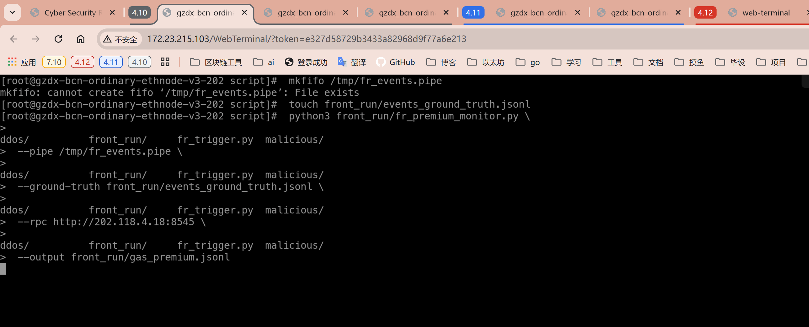
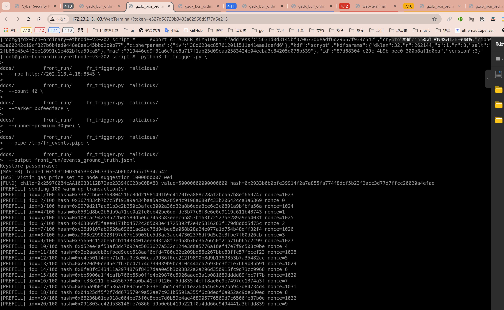
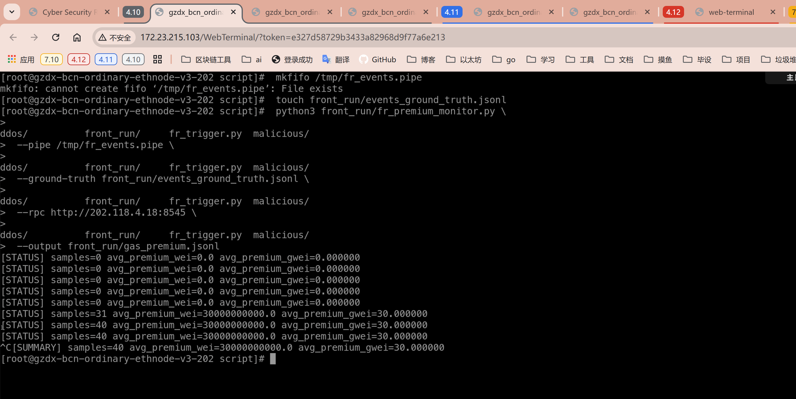

3.2.3.22 抢跑平均 Gas 溢价 (Average Gas Premium)
============================================

定义
----
平均 Gas 溢价衡量在每个抢跑事件中，runner 为了抢在受害者前成交所额外支付的 gas 单价差值。我们将 `effectiveGasPrice`（若可获得）或 `maxFeePerGas/maxPriorityFeePerGas` 统一换算成单位 Wei，并统计 runner 与 victim 的差值。该指标用于评估抢跑行为的成本。

指标体系
--------
- `A`：测量窗口内的抢跑事件集合（与成功率指标准备的事件集一致）。
- `Δ_gas(i)`：第 `i` 个事件中 runner 与 victim 的有效 gas 单价差。优先使用实际成交价 `effectiveGasPrice`；若缺失，则 `maxFeePerGas - baseFee` 近似。

平均 Gas 溢价定义为：

\[ AGP = \frac{1}{|A_v|} \sum_{i\in A_v} \Delta_{gas}(i) \]

其中 `A_v ⊆ A` 为拥有完整 gas 数据的事件子集。若 `A_v` 为空，脚本输出“无有效样本”。同时记录 `|A|`、`|A_v|`，帮助评估数据缺失比例。

观测数据来源
------------
1. **统一触发器**：`fr_trigger.py` 在 ground-truth 中保存 victim/runner 的交易参数，包含初始 gas price 设置与发送时间，为后续对比提供参考。若启用 `--pipe`，`fr-trigger-tx-v1` 流会携带 `gas_price` 字段，可在交易广播瞬间记录基准。
2. **pending 视图**：`fr_premium_monitor.py` 轮询 `eth_pendingTransactions` 捕获交易首见时的 gas 字段；当命名管道可用时，优先以管道数据建立事件索引，RPC 仅作为补充。若节点不支持该接口，回退到 `eth_getBlock("pending", full_transactions=True)`。
3. **区块回执**：脚本定期调用 `eth_getTransactionReceipt` 以获取 `effectiveGasPrice`，并记录交易所在区块的 `baseFeePerGas`。

实验流程
--------
1. **准备命名管道并启动溢价监测脚本**：
	 ```sh
	 mkfifo /tmp/fr_events.pipe
	 touch front_run/events_ground_truth.jsonl
	 python3 front_run/fr_premium_monitor.py \
		 --pipe /tmp/fr_events.pipe \
		 --ground-truth front_run/events_ground_truth.jsonl \
		 --rpc http://202.118.4.18:8545 \
		 --output front_run/gas_premium.jsonl
	 ```
	 - 若有多个 RPC，可重复添加 `--rpc` 或使用 `--hosts hosts_fr.txt`（每行一个 HTTP 地址），脚本会轮询查询交易详情。
	 - FIFO 优先记录首见 gas 字段，若 FIFO 暂不可用则脚本会等待；也可仅依赖 RPC，但可能错过瞬时 gas 设置。

2. **运行触发器**：同成功率实验，保证每个事件中 runner 设置比 victim 更高的 fee，或配置 `--runner-premium` 自定义差值。
	 ```sh
    export ATTACKER_KEYSTORE='{"address":"5631d0d3145bf370673d6eadf6d29657f934c542","crypto":{"cipher":"aes-128-ctr","ciphertext":"98553dd168cb6da7feb3a9a3a60242c19cf827b6b4ed0448e8ea145bbd2b0b77","cipherparams":{"iv":"38d623ec857612011511e41eaa1cefd6"},"kdf":"scrypt","kdfparams":{"dklen":32,"n":262144,"p":1,"r":8,"salt":"7877745b08004d6737b64d8b9889192fb68e45e4f2ee18991c1e482bfea59ca5"},"mac":"719446ed9f31a6c7ac6a717f1ab25d09eaa2583424e04ecba3c84205d076b539"},"id":"87d68304-c29c-4b9b-bec0-300b8af1d0ba","version":3}'
	 python3 fr_trigger.py \
		 --rpc http://202.118.4.18:8545 \
		 --count 40 \
		 --marker 0xfeedface \
		 --runner-premium 30gwei \
		 --pipe /tmp/fr_events.pipe \
		 --output front_run/events_ground_truth.jsonl
	 ```
	 触发器运行期间，溢价监测脚本持续从管道与 `events_ground_truth.jsonl` 读取交易，并轮询回执。

3. **汇总指标**：idle timeout 触发时，脚本输出 `|A|`、`|A_v|`、`AGP`，并统计 runner 比 victim 高多少百分比（`Δ_gas / gas_v`）。


记录与追溯
----------
- `gas_premium.jsonl`：包含 `pair_id`、`event_id`、`runner_effective`、`victim_effective`、`premium`、`priority_delta` 等字段，并附带时间戳。
- `premium_summary.txt`（可选）：脚本自动输出统计概览，列出溢价最大/最小的事件供排查。

伪代码
------
```
加载配置()
事件索引 = {}

监听 FIFO, 捕获首见 gas 信息并写入事件索引

循环直到全部事件完成或停止:
	对每个事件:
		若缺少 pending 数据:
			调用 eth_getTransaction 获取交易体
		若尚无回执:
			调用 eth_getTransactionReceipt
			若超时, 标记 incomplete
		若获取到回执:
			victim_effective = 计算实际 gas 单价
			runner_effective = 同上
			Δ = runner_effective - victim_effective
			写入 gas_premium.jsonl

计算 |A|、|A_v|、AGP
输出统计摘要 (均值/最大/最小/百分比)
```

实现注意事项
------------
- 若节点返回的是 `maxFeePerGas`/`maxPriorityFeePerGas`，需结合区块 `baseFeePerGas` 计算实际支付：`effective = min(maxFeePerGas, baseFeePerGas + maxPriorityFeePerGas)`。
- 缺少任何一方的 gas 数据时，不应直接设为 0，应从 `A_v` 中剔除并单独列出原因（如“回执缺失”、“pending 未命中”）。
- 在 EIP-1559 环境下，`effectiveGasPrice` 可能低于设置值，需记录 both `effective` 与 `maxFee`，以便分析策略是否过度竞价。
- 命名管道断连时应自动回退至纯 RPC 模式，并在结果摘要中记录数据来源占比（pipe-only / rpc-only / mixed）。