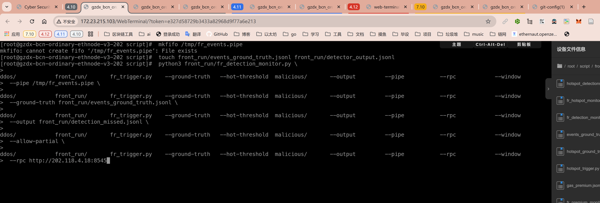
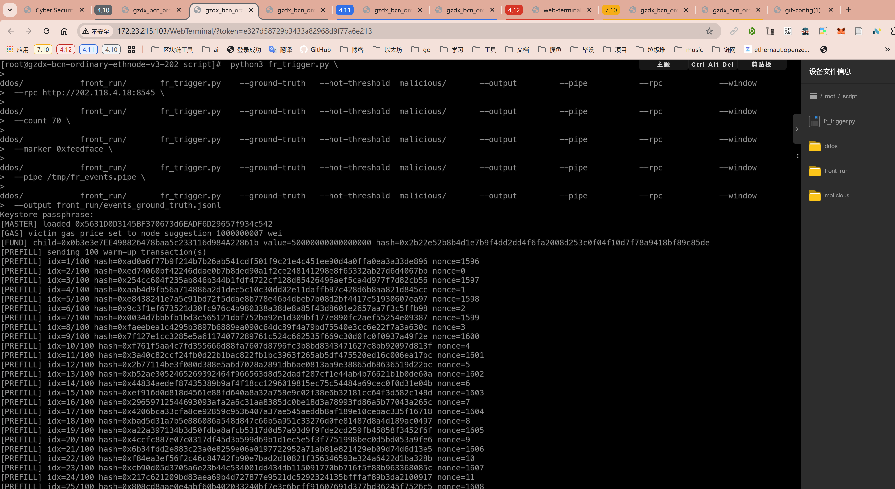
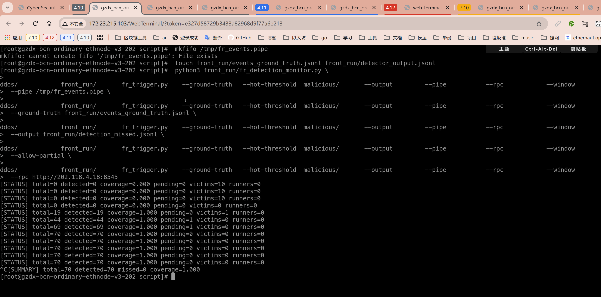

3.2.3.23 抢跑交易识别率 (Front-running Detection Coverage)
==============================================

定义
----
识别率衡量系统在真实发生的抢跑事件中，成功识别并输出告警的比例。利用统一触发器生成带标记的受害/抢跑交易对，将其视为可控的“真值集”。检测脚本需在同一时间窗口内独立运行，输出自认为的抢跑事件列表，再与真值对齐。

指标体系
--------
- `N`：真值集中记录的抢跑事件总数。由 `fr_trigger.py` 输出的 `events_ground_truth.jsonl` 提供。
- `T_t`：检测脚本 `fr_detection_monitor.py` 成功识别并匹配到真值事件的数量。匹配依据为 `(victim_hash, runner_hash)` 或统一的 `event_id`。

识别率定义为：

\[ FDC = \frac{T_t}{N} \]

若检测脚本产生额外未在真值中的事件（可能是真实线上流量或误报），需要在结果中列出并标记为“未匹配”。

观测数据来源
------------
1. **真值集**：`fr_trigger.py` 在每次事件生成时写入 ground-truth，字段包括 `event_id`、`victim_hash`、`runner_hash`、`timestamp` 等，并可通过命名管道实时推送 `fr-trigger-tx-v1` 行，供检测脚本在零延迟下同步真值。当前仅生成单腿抢跑事件。
实验流程
--------
1. **准备命名管道并启动覆盖率脚本**：
	 ```sh
	 mkfifo /tmp/fr_events.pipe
	 touch front_run/events_ground_truth.jsonl front_run/detector_output.jsonl
	 python3 front_run/fr_detection_monitor.py \
		 --pipe /tmp/fr_events.pipe \
		 --ground-truth front_run/events_ground_truth.jsonl \
		 --output front_run/detection_missed.jsonl \
		 --allow-partial \
		 --rpc http://202.118.4.18:8545
	 ```
	 - FIFO 需在触发器启动前创建并监听，脚本若检测不到会每秒重试。
	 - `--detections` 指向检测引擎输出文件，覆盖率脚本以尾部跟踪方式读取增量行。
	 - `--allow-partial` 可选；开启后若只凭受害者哈希即可唯一定位事件，会视作命中。

2. **准备检测结果 JSONL**：
	 本仓库未内置抢跑识别算法，请根据实际检测方案（离线标注、外部识别器、线上日志等）生成 `fr-detector-event-v1` 结构的 JSONL，并持续追加到 `front_run/detector_output.jsonl`。关键字段至少包含 `pair_id` 或 `event_id`，若缺失则需同时提供 `(victim_hash, runner_hash)` 以便匹配。
	 - 若数据源来自线上检测器，可直接将其输出重定向到该文件。
	 - 若使用人工标注，可手动构造 JSONL 行再附加到文件中。
3. **触发器准备**：
	 ```sh
	 python3 fr_trigger.py \
		 --rpc http://202.118.4.18:8545 \
		 --count 70 \
		 --marker 0xfeedface \
		 --pipe /tmp/fr_events.pipe \
		 --output front_run/events_ground_truth.jsonl
	 ```
	 保持触发器、检测数据写入与覆盖率脚本同时运行至所有事件完成，覆盖率脚本会定期打印 `[STATUS] total=... detected=... coverage=... pending=...]` 并在退出时输出汇总指标。



记录与追溯
----------
- `events_ground_truth.jsonl`：触发器真值集，记录单腿抢跑事件，包含 `target_address` 以便交叉验证热点或识别覆盖率；需同时保存触发参数。
- `detector_output.jsonl`：检测引擎识别结果，建议包含 `source_rpc`、`confidence` 等。
- `detection_missed.jsonl`：覆盖率脚本可选输出的漏报清单，记录 `pair_id`、`event_id`、交易哈希与首次观测时间。
- 终端输出：覆盖率脚本退出时打印 `[SUMMARY] total=... detected=... coverage=...]`，并在存在未匹配检测结果时追加 `[WARN]` 提示。

伪代码
------
```
加载配置()
truth = 读入 events_ground_truth.jsonl -> {pair_id: (event_id, victim_hash, runner_hash)}
pending_detections = []

启动 FIFO 线程，实时补齐尚未落盘的 truth 事件

循环直到停止:
	truth += ground_truth 新行
	detections = 读取 detector_output.jsonl 新行
	对 detection:
		按 pair_id -> event_id -> (victim_hash, runner_hash) 顺序尝试匹配
		若成功: state.detected = True, 记录 detected_at
		若失败: pending_detections.append(detection)
	紧接着重试 pending_detections（防止先后顺序不同）
	定期统计 total = |truth|（含 event_id）、detected = 已匹配数量，打印 coverage = detected / total

退出前:
	将未命中的 truth 写入 detection_missed.jsonl（若指定）
	对剩余 pending_detections 打印 WARN，视作潜在误报
```

实现注意事项
------------
- `fr_detection_monitor.py` 应在内部维护窗口状态，避免同一事件重复输出，事件 ID 可由 `victim_hash + runner_hash` 拼接。若管道断开或重连，务必重新同步最近的 `pair_id` 范围。
- 当前指标专注单腿抢跑；如需扩展多腿模式，应在触发器与检测器中重新设计事件结构。
- 对未匹配的检测结果，应当保留 hash 及观测时间，便于后续人工分析是否为真实抢跑（从而扩充真值集）。