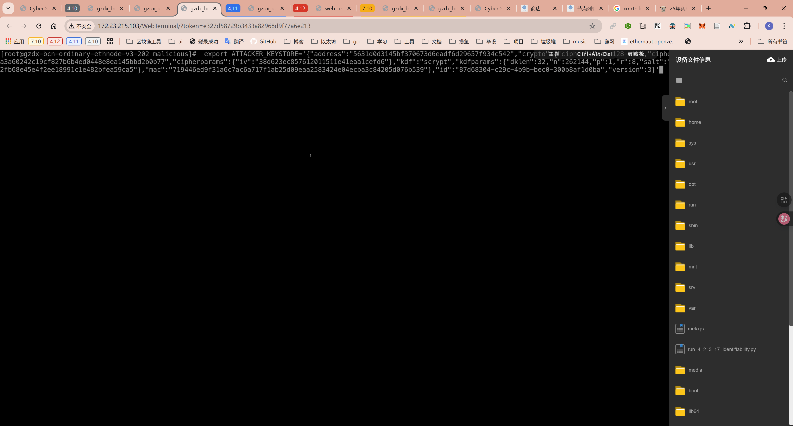
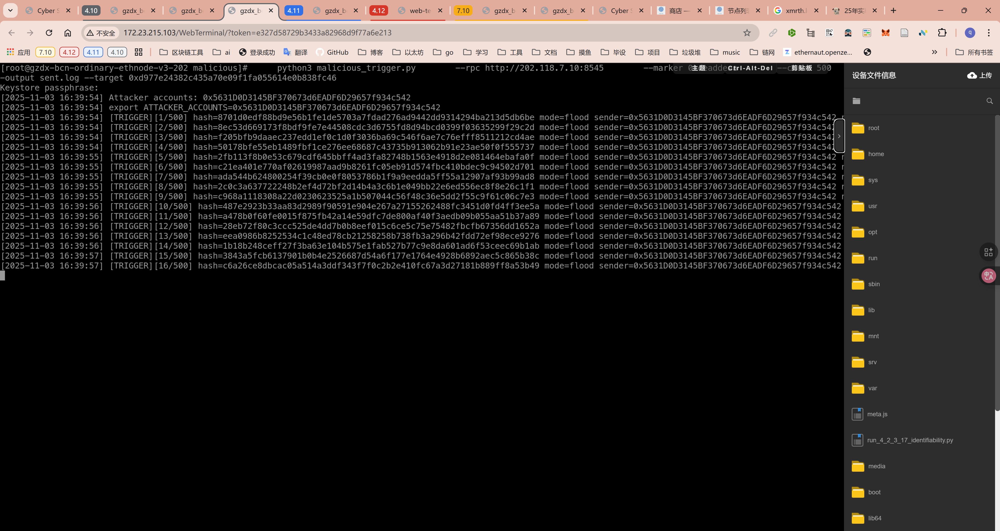
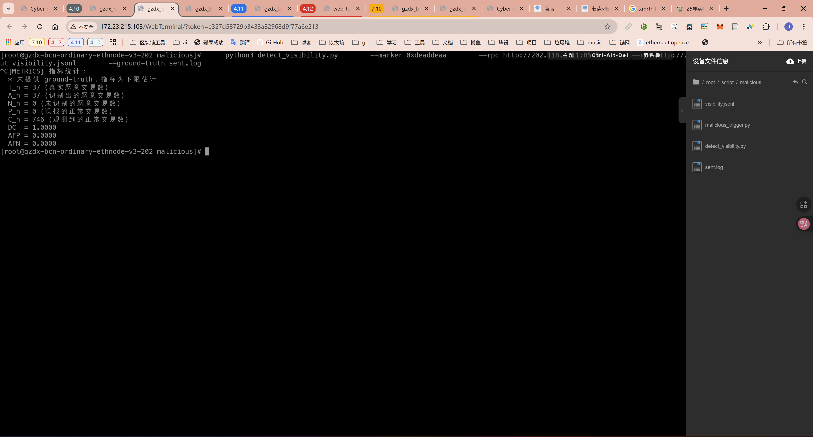
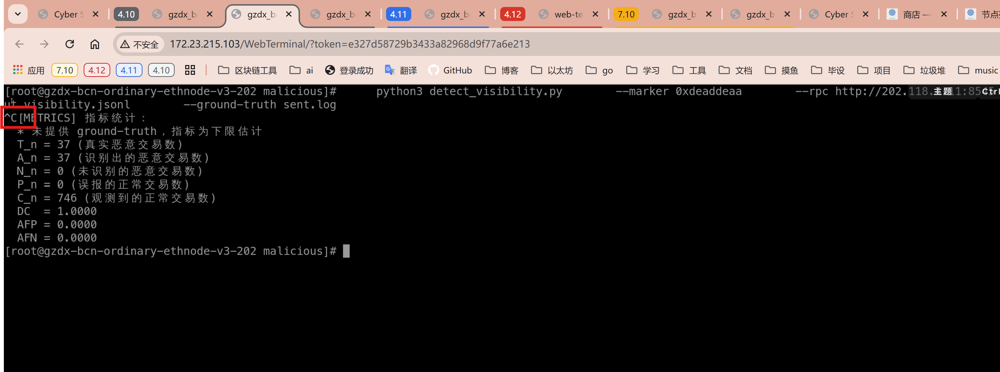

3.2.3.17 恶意交易可识别性
===========================

定义
----
恶意交易可识别性衡量链网节点或外部监测系统，仅凭交易 `input` 字段中预设标记前缀，即可识别与归类恶意交易的能力。实验默认约定：凡是 `input` 开头包含固定标记（如 `0xdeaddead`）的交易视为恶意，其余交易视为正常。

指标体系
--------
监测脚本在整个采集窗口内维护以下集合：
- `T_n`：真实恶意交易集合（通常由触发脚本日志或 ground-truth 文件给出）。
- `A_n`：被监测脚本判定为恶意的交易集合。
- `P_n`：实际正常但被监测脚本误判为恶意的交易集合。
- `N_n`：真实恶意但被监测脚本遗漏的交易集合，即 `T_n - A_n`。
- `C_n`：观测到的正常交易集合，用于衡量误报分母。

据此定义三项指标：
1. **识别覆盖率 DC (Detection Coverage Ratio)**：`DC = |A_n| / |T_n|`，反映真实恶意交易被命中的比例。
2. **攻击误报率 AFP (Attack False Positive Ratio)**：`AFP = |P_n| / |C_n|`，衡量正常交易被误判为恶意的概率。
3. **攻击漏报率 AFN (Attack False Negative Ratio)**：`AFN = |N_n| / |T_n|`，刻画真实恶意交易被漏检的比例。

> 若实验无法提供 ground-truth，只能使用 `A_n` 近似 `T_n`。脚本会在结果中注明“缺少 ground-truth，指标仅供参考”。

观测数据来源
------------
1. **恶意样本**：`malicious_trigger.py` 依据统一标记生成攻击交易，启动时输出 `ATTACKER_ACCOUNTS` 及可选的 ground-truth 文件（每行一个哈希或 JSONL 中的 `tx_hash` 字段）。
2. **正常流量**：`background_traffic_sender.py` 等脚本持续产生日常交易，用于填充 `C_n`。
3. **监测脚本**：重写后的 `detect_visibility.py` 采用 `ThreadPoolExecutor` 并行轮询各节点，依次尝试 `eth_pendingTransactions` 与 `eth_getBlock("pending", full_transactions=True)`，通过 `input` 标记识别恶意交易，并在 Ctrl-C 时自动汇总指标。

实验流程
--------
1. **准备阶段**：
 export ATTACKER_KEYSTORE='{"address":"5631d0d3145bf370673d6eadf6d29657f934c542","crypto":{"cipher":"aes-128-ctr","ciphertext":"98553dd168cb6da7feb3a9a3a60242c19cf827b6b4ed0448e8ea145bbd2b0b77","cipherparams":{"iv":"38d623ec857612011511e41eaa1cefd6"},"kdf":"scrypt","kdfparams":{"dklen":32,"n":262144,"p":1,"r":8,"salt":"7877745b08004d6737b64d8b9889192fb68e45e4f2ee18991c1e482bfea59ca5"},"mac":"719446ed9f31a6c7ac6a717f1ab25d09eaa2583424e04ecba3c84205d076b539"},"id":"87d68304-c29c-4b9b-bec0-300b8af1d0ba","version":3}'


   - 在攻击节点执行触发脚本，示例命令：
     ```sh
     python3 malicious_trigger.py \
       --rpc http://202.118.7.10:8545 \
       --marker 0xdeaddead \
       --count 500 \
       --reject-ratio 0.2 \
       --output sent.log
     ```


2. **部署监测脚本**：
   - 在至少两个观测节点运行新版本脚本：
     ```sh
     python3 detect_visibility.py \
       --marker 0xdeaddead \
       --rpc http://202.118.4.11:8545 \
       --rpc http://202.118.7.10:8545 \
       --output visibility.jsonl \
       --ground-truth sent.log
     ```
  
3. **采集阶段**：
   - 保持攻击与背景脚本运行至少 5× 轮询间隔；监测脚本会记录所有观察到的交易哈希，并区分是否带标记。
4. **结束阶段**：
   - 依次停止触发脚本与背景流量，等待 1 个轮询间隔，再通过 Ctrl-C 结束监测脚本。
   - 监测脚本会打印 `T_n/A_n/N_n/P_n/C_n` 及 DC/AFP/AFN，若存在 `--output`，最后一行也会写入同样的指标快照。
   

记录与追溯
----------
- 保存 `sent.log`（触发脚本输出）、`visibility.jsonl`（监测脚本采集）、终端指标打印三者，以便复核。
- JSONL 记录包含观测时间戳、哈希、来源节点等信息，可用于后续诊断误报/漏报原因。
- 建议在实验报告中附上环境配置、标记前缀、轮询间隔、采集窗口长度等上下文信息。

伪代码
------
```
解析命令行参数（marker、poll、ground-truth、输出路径、多个 --rpc/--ipc）
初始化 providers 列表、集合 observed_all / observed_marked

while True:
    now = 当前时间
  并行提交 provider.collect_pending 任务
  for provider, tx_list in 收集到的结果:
    调用 provider.iter_pending_transactions()
    遍历 pending 队列中的交易，提取哈希
      统一转小写十六进制，加入 observed_all
      若 input 以 marker 开头，则加入 observed_marked
  每隔固定周期写出 JSONL（包含最新观测的哈希与来源）
  sleep(poll)

捕获 KeyboardInterrupt:
  加载 ground-truth（若指定），确保读入最新日志
    根据 ground-truth 与两个集合计算 T_n / A_n / P_n / N_n / C_n
    打印 DC、AFP、AFN；若指定 --output 则追加一条指标 JSON
```

- 轮询使用标准库 `concurrent.futures.ThreadPoolExecutor` 并行提交任务，Python 3.12 默认环境已包含该模块；`eth_pendingTransactions` 不是所有节点都支持，脚本会自动回退到 pending block。
- 为避免重复计数，所有哈希统一转换为小写；如 RPC 提供的是字节串，需调用 `Web3.to_hex`。
- `--ground-truth` 支持两种格式：纯文本或 JSONL。文本行可为完整日志，脚本会自动提取第一段 66 字符的交易哈希；JSONL 则读取 `tx_hash`/`hash` 字段。
- 当缺失 ground-truth 时，脚本会声明指标为下限估计：`T_n=A_n`、`N_n=0`、`P_n=0`。
- 输出 JSONL 时保持 ASCII，保留 `[VISIBILITY]`、`[METRICS]` 等日志前缀，便于日志收集系统检索。