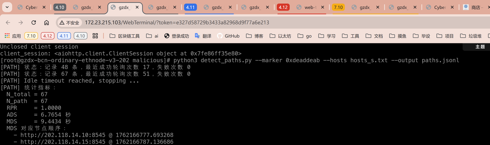
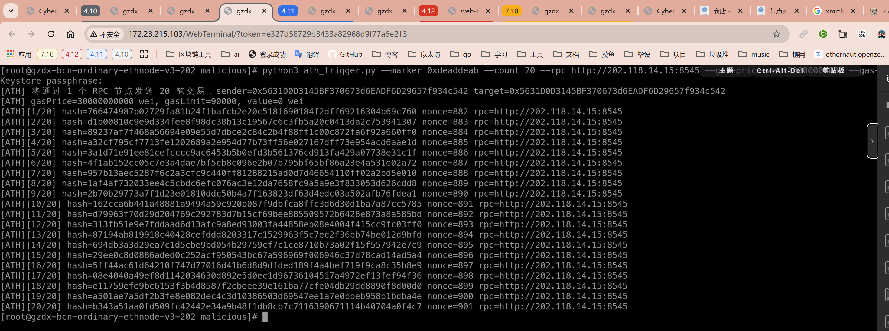

3.2.3.18 恶意交易轨迹追踪能力
===============================

定义
----
衡量链网在标记交易流经节点后，能否依靠多节点的 RPC 观测记录出完整传播路径的能力。标记交易定义为 `input` 前缀带固定标记（如 `0xdeaddead`）且使用正常 gas 参数（gas price、gas limit 均达到主网推荐值或更高）的普通转账交易，确保能够在各节点间顺利转发。为便于校验路径，可通过额外参数生成少量不同数量级的交易批次，但不再使用拒绝类场景（重复 nonce、低 gas 等）。

指标
----
1. **可重建路径率 RPR (Reconstructable Path Ratio)**：被至少两个观测节点捕获、能够恢复传播顺序的恶意交易占比。
   - 公式：`RPR = N_path / N_total`
   - `N_total`：观测脚本识别到的恶意交易数量；`N_path`：在两个及以上节点拥有“首次出现时间”的交易数量。
2. **平均首尾时差 ADS (Average Detection Spread)**：对可重建路径的交易，计算最早与最晚节点首见时间差的平均值。
   - 公式：`ADS = (1 / N_path) * Σ (t_last - t_first)`
   - `t_first` / `t_last`：该交易在观察节点集合中的最早 / 最晚首见时间。
3. **最大首尾时差 MDS (Maximum Detection Spread)**：所有可重建路径交易中的最大首尾时间差，并展示对应交易在各节点的时间序列。
   - 公式：`MDS = max(t_last - t_first)`
   - 输出时需列出该交易在每个节点的首见时间，并按时间排序，附上具体差值。

- **数据采集**：观测脚本读取 `hosts_s.txt` 中列出的 RPC 地址（每行一个），并行请求各节点的 `eth_pendingTransactions`，若节点不支持则回退至 `eth_getBlock("pending", full_transactions=True)`；记录标记交易在每个节点的首见时间、状态，并在交易上链时补充 `eth_getTransactionReceipt` 与区块时间。
- **时间标准化**：脚本在写入 JSONL 时附带节点本地时间与可选 NTP 偏移；汇总程序使用合法交易的首见时间或显式偏移对齐所有时间戳。
- **路径建模**：为每笔交易构建首见时间表，若至少两个节点出现记录，则按时间排序得到传播序列；仅单节点记录的交易视为“无法重建路径”并剔除。
- **最大时差追踪**：除统计平均值外，还需寻找 `t_last - t_first` 的最大值，输出该交易在所有节点的首见时间（按时间排序）及对应时间差，以便复现传播路径。
- **退出条件**：脚本持续轮询，一旦检测到至少一笔恶意交易，在所有节点上连续 5 秒未见新样本后自动收尾并输出指标。
- **指标输出**：汇总程序计算 RPR、ADS、MDS，并给出样本数量、节点覆盖率以及 MDS 对应的交易详情。

操作步骤
--------
1. **准备 hosts_s.txt**：在监测节点放置 `hosts_s.txt`，每行写一个待观测节点的 RPC 地址（可含端口），脚本启动时将一次性读取。
2. **部署观测脚本**：运行 `python3 detect_paths.py --marker 0xdeaddead --hosts hosts_s.txt --output paths.jsonl`，脚本会基于 `asyncio` 并行轮询所有节点并维护首见时间表。

3. **投放标记交易**：执行全新 18 专用触发器（例如 `python3 ath_trigger.py --marker 0xdeaddeab --count 200 --rpc http://202.118.14.15:8545 --gas-price-wei 30000000000 --gas-limit 90000`），向指定 RPC 节点批量发送带标记的正常交易。触发器需：
   - 支持配置交易数量、gas price、gas limit 等参数，默认采用主网推荐值；
   - 复用节点现有账户或外部私钥签名，确保交易能成功广播；
   - 仅发送会被网络正常接受的交易，从而聚焦传播路径的完整性。

4. **观测与退出**：脚本持续轮询，若在所有节点上连续 5 秒未看到新的标记交易，则自动停止并输出运行概览。


伪代码
--------
```
解析命令行参数（标记前缀、轮询间隔、输出路径、hosts.txt）
读取 hosts.txt，逐行解析 RPC 地址并建立连接
初始化 path_table：键为 tx_hash，值包含 {from, 首见时间表、最后更新时间、状态}

循环执行：
   now = 当前时间
   新样本标记 = False
   并发请求所有节点：
      优先调用 eth_pendingTransactions，若失败则调用 eth_getBlock("pending", full_transactions=True)
      筛选 input 以 marker 开头的交易
      若首见时间表中无该哈希：
         记录 first_seen[node]=now，并将新样本标记为 True
      否则更新 last_seen[node]=now
   对每个交易：
      若至少两个节点出现记录且尚未查询回执：
         调用 eth_getTransactionReceipt 获取状态
         记录区块时间或失败原因
   将新增首见记录、状态变化写入 JSONL，事件记录内含 source 节点、观测时间
   如果已经观察到至少一笔交易，且在最近 5 秒内未有新样本标记，则跳出循环
   否则休眠轮询间隔

结束后：
   过滤掉仅一个节点观测到的交易
   计算每笔交易的 t_last - t_first，得到平均值 ADS 和最大值 MDS
   将 MDS 对应交易的节点时间序列按时间排序输出
```