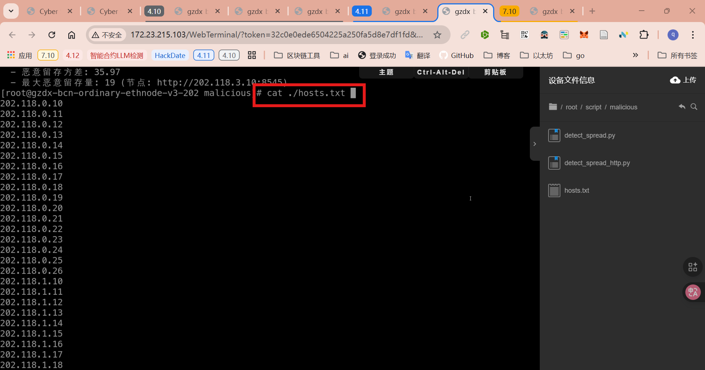
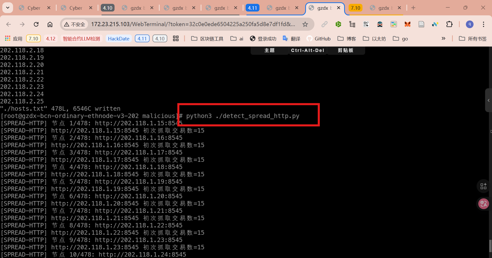
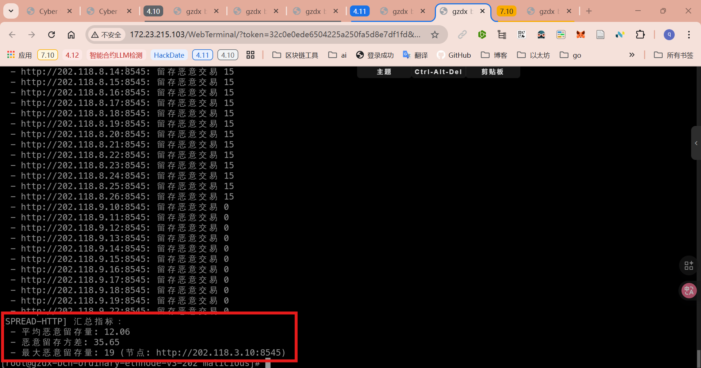

3.2.3.19 恶意交易攻击流量传播范围
==================================

定义
----
衡量恶意交易在链网各节点交易池中的留存分布情况，关注攻击流量在各节点造成的堆积程度。当同一笔交易在节点的 `txpool` 中至少持续 10 秒仍未离开，即视为“留存的恶意交易”。

指标
----
1. **平均恶意留存量**：所有可连通节点的恶意留存交易数量的平均值。
   - 公式：`平均留存量 = (1 / N) * Σ L_i`
   - `L_i`：节点 i 在 10 秒确认后仍存在的恶意交易数量；`N`：成功建立连接的节点数。
2. **恶意留存方差**：衡量各节点恶意留存量的离散程度，反映负载是否集中。
   - 公式：`方差 = (1 / N) * Σ (L_i - 平均留存量)^2`
3. **最大恶意留存量**：单个节点观测到的最大留存恶意交易数，用于定位最受影响的节点。

测量方案
--------
- **数据采集**：脚本默认读取本目录 `hosts.txt`，逐行解析 RPC 地址（允许空行与注释行）。对每个地址：
   1. 第一轮遍历所有可连通节点，逐一建立连接并抓取一次 `txpool.content`，记录交易哈希集合与时间戳；
   2. 第二轮按相同顺序复查各节点，若距离首次抓取不足 10 秒则补足剩余时间再执行，否则直接抓取；若某节点首次抓取数量为 0，则无需复查直接记录为 0；
   3. 对两次哈希集合求交集，得到该节点的恶意留存量 `L_i`。
- **数据整理**：将所有成功节点的 `L_i` 汇总，计算平均值、方差、最大值，同时输出每个节点对应的留存数量，方便定位问题节点。
- **结果输出**：控制台打印节点级明细与三项指标，供人工快速研判；不默认写入外部文件，如需存档可手动重定向输出。

操作步骤
--------
1. **准备 hosts.txt**：确认目标目录的 `hosts.txt` 列出需观测的 RPC 地址。

2. **执行观测脚本**：在任意监测节点运行 `python3 detect_spread_http.py`（如需手动指定路径可用 `--hosts ./hosts.txt`）。脚本会先完成所有节点的第一次抓取并打印编号，若某节点不可达会提示并跳过。

3. **等待确认**：第二轮按同一顺序复查节点，若两次抓取间隔不足 10 秒则自动等待补足，否则直接执行；初次抓取为 0 的节点会直接记为 0 并跳过复查；最终在控制台输出每个节点的恶意留存量。
4. **汇总指标**：脚本尾部打印平均恶意留存量、恶意留存方差、最大恶意留存量（附带对应节点），用于衡量链网整体状态。

5. **后续分析**：如需保留数据，可手动将输出重定向至文件；若要进一步定位原因，可结合节点日志、`txpool.inspect` 或 DDoS/恶意触发脚本记录交叉分析。

伪代码
--------
```
解析命令行参数（hosts.txt 路径、确认间隔、超时时间）
读取 hosts.txt，过滤空行与注释，得到 RPC 地址列表

node_state = {}
for index, rpc in enumerate(rpc_list, start=1):
   打印当前节点编号 index/总数
   建立 RPC 连接，失败则记录 warning 并 continue
   snapshot = 获取 txpool.content() 中的交易哈希集合
   如果 snapshot 为空：记录 per_node[rpc] = 0 并 continue
   node_state[rpc] = (连接对象, snapshot, 当前时间)

per_node = {}
for rpc, (连接对象, snapshot, first_time) in node_state.items():
   elapsed = 当前时间 - first_time
   若 elapsed < 确认间隔，则等待 确认间隔 - elapsed
   second_snapshot = 再次获取同一节点的哈希集合
   retained = snapshot ∩ second_snapshot
   per_node[rpc] = len(retained)

输出每个节点的 retained 数量
计算平均值、方差、最大值并打印
```